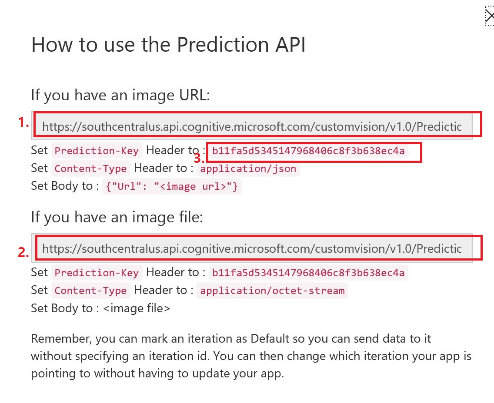
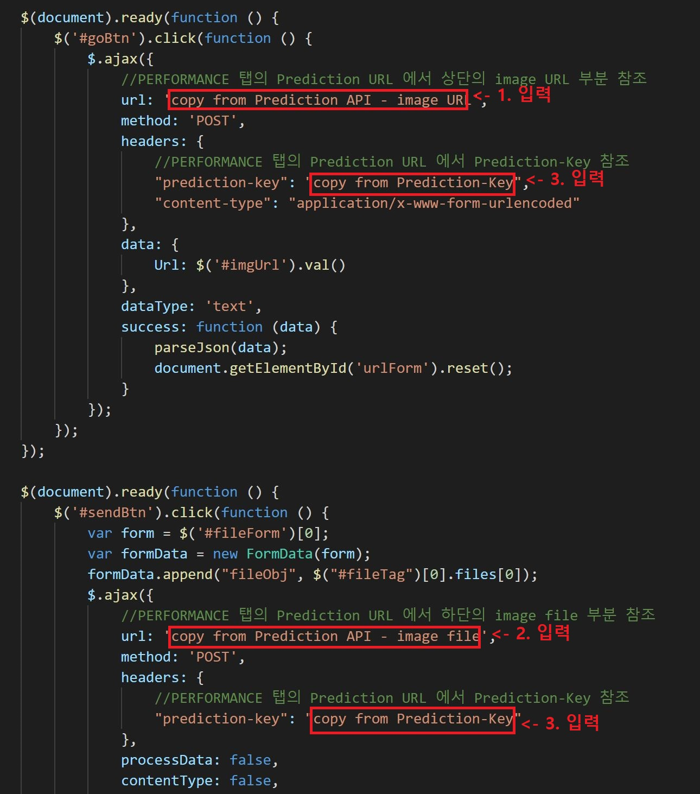
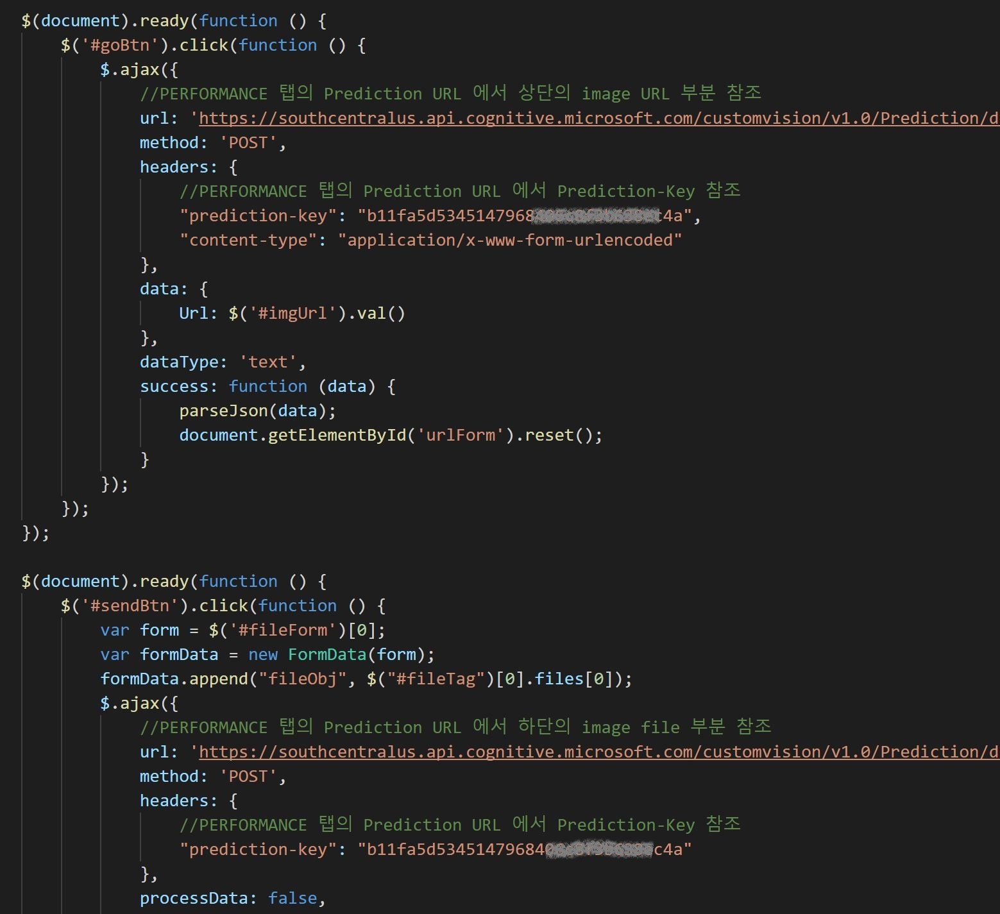
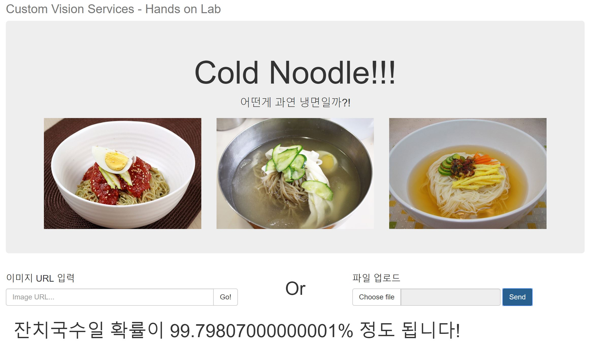

# 간단한 웹페이지를 생성하고 Custom Vision API 활용해보기

이번에는 간단한 웹페이지를 생성하고 웹 페이지에서 API호출을 통해 Custom Vision API를 사용해보겠습니다. 
Custom Vision 폴더아래의 Example 폴더에는 미리 만들어둔 Custom Vision API를 사용하기 위한 페이지 및 필요한 파일들이 포함되어 있습니다. 

## noodle.html 페이지 살펴보기

선호하시는 브라우저를 이용하여 **noodle.html** 파일을 오픈하시기 바랍니다. Custom Vision의 Quick Test에서 테스트 했던것과 같은 방식으로 이미지의 URL을 입력하거나 이미지 파일을 직접 업로드하여 결과를 확인하실 수 있습니다. 
이 페이지의 주요 역할은 Custom Vision API에 HTTP POST 요청을 통해 이미지 데이터를 전송하면, json 형태의 응답을 파싱해서 사용자에게 보여주는 것 입니다. 

* 이미지 URL 전송: 사용자가 Url을 입력하면 Javascript 함수에서 이를 처리하고 결과값을 출력합니다. 
```
<!--사용자의 Url 입력을 받는 부분-->
<form id="urlForm">
    <div class="input-group">
        <input id="imgUrl" type="text" class="form-control" placeholder="Image URL...">
        <span class="input-group-btn">
            <button id="goBtn" class="btn btn-default" type="button">Go!</button>
        </span>
    </div>
</form>

<!--Custom Vision API에 Url을 전송하고 응답을 처리하는 부분-->
$(document).ready(function () {
    $('#goBtn').click(function () {
        $.ajax({
            //PERFORMANCE 탭의 Prediction URL 에서 상단의 image URL 부분 참조 
            url: 'copy from Prediction API - image URL',
            method: 'POST',
            headers: {
                //PERFORMANCE 탭의 Prediction URL 에서 Prediction-Key 참조 
                "prediction-key": "copy from Prediction-Key",
                "content-type": "application/x-www-form-urlencoded"
            },
            data: {
                Url: $('#imgUrl').val()
            },
            dataType: 'text',
            success: function (data) {
                parseJson(data);
                document.getElementById('urlForm').reset();
            }
        });
    });
});
```
* 이미지 file 전송: 사용자가 이미지 파일을 업로드 하면 Javascript 함수에서 이를 처리하고 결과값을 보여줍니다. 
```
<!--사용자가 이미지 파일을 업로드 하는 부분-->
<form class="form-inline" id="fileForm" method="post" enctype="multipart/form-data">
    <input type="file" id="fileTag" name="fileTag" class="filestyle" data-icon="false" data-buttonBefore="true" />
    <button id="sendBtn" class="btn btn-primary" type="button">Send</button>
</form>

<!--Custom Vision API에 파일을 전송하고 응답을 처리하는 부분-->
$(document).ready(function () {
    $('#sendBtn').click(function () {
        var form = $('#fileForm')[0];
        var formData = new FormData(form);
        formData.append("fileObj", $("#fileTag")[0].files[0]);
        $.ajax({
            //PERFORMANCE 탭의 Prediction URL 에서 하단의 image file 부분 참조 
            url: 'copy from Prediction API - image file',
            method: 'POST',
            headers: {
                //PERFORMANCE 탭의 Prediction URL 에서 Prediction-Key 참조 
                "prediction-key": "copy from Prediction-Key"
            },
            processData: false,
            contentType: false,
            data: formData,
            dataType: 'text',
            success: function (data) {
                parseJson(data);
                document.getElementById('fileForm').reset();
            }
        });
    });
});
```
* JSON 데이터 파싱: parseJson 함수에서는 JSON 형태로 온 결과값을 파싱하여 사용자에게 보여줍니다.
```
function parseJson(data) {
    var object = JSON.parse(data);
    var percentValue = object.Predictions[0].Probability;
    var noodleValue = object.Predictions[0].Tag;
    if (percentValue > 0.9) {
        percentValue = percentValue * 100;
        $('#percent').append(percentValue);
        $('#noodleName').append(noodleValue);

        var resultMessage = '<h1>' + noodleValue + '일 확률이 ' + percentValue + '% 정도 됩니다!</h1>';
        document.getElementById('resultContainer').innerHTML = resultMessage;
    }
    else if (percentValue > 0.5) {
        percentValue = percentValue * 100;
        $('#percent').append(percentValue);
        $('#noodleName').append(noodleValue);

        var resultMessage = '<h1>확실하진 않지만... ' + noodleValue + '일 확률이 ' + percentValue + '% 정도 됩니다!</h1>';
        document.getElementById('resultContainer').innerHTML = resultMessage;
    }
    else {
        var exceptionMessage = '<h1>이거 냉면사진 맞아요? 아닌것 같은데...</h1>'
        document.getElementById('resultContainer').innerHTML = exceptionMessage;
    }
}
```

## Custom Vision API 호출에 필요한 값 입력하기

이미 테스트를 해 보신 분들은 아시겠지만 noodle.html 페이지는 현재 동작하지 않습니다. 그 이유는 요청 URL 주소 및 Key 값이 유효하지 않기 때문입니다. 

**01_Training Images** 페이지의 맨 마지막에 안내되어 있는데로, **PERFORMANCE** 탭의 **Prediction URL**을 클릭하셔서 **Prediction-Key**및 **URL 주소**를 확인하신 후 **noodle.html** 페이지의 해당 위치에 아래와 같이 알맞게 입력하시기 바랍니다. 



완성된 모습은 다음과 같습니다(예시)


## noodle.html 페이지 테스트하기

변경사항을 저장하신 후 **noodle.html** 페이지를 새로고침 하여 테스트해보시기 바랍니다. 잘 동작하는 것을 확인하실 수 있습니다. 



