# Azure Web Apps에 페이지 배포하기

Azure Web Apps 이란 클라우드 기반의 웹서비스 배포 환경입니다. 번거롭게 호스팅 서비스를 이용하거나, 내가 직접 서버를 운영하지 않아도 아주 간단하고 편리하게 내가 만든 웹 서비스를 배포할 수 있습니다. 이번 실습에서 만든 **index.html** 페이지를 친구들도 볼 수 있도록 Azure Web Apps를 이용하여 배포해보겠습니다. 

## Azure Web Apps 생성하기 

Azure의 서비스들 중 몇 가지를 잠시동안 무료로 사용해 볼 수 있는 사이트가 있습니다. [https://azure.microsoft.com/en-us/try/app-service/](https://azure.microsoft.com/en-us/try/app-service/)에 접속하시기 바랍니다.
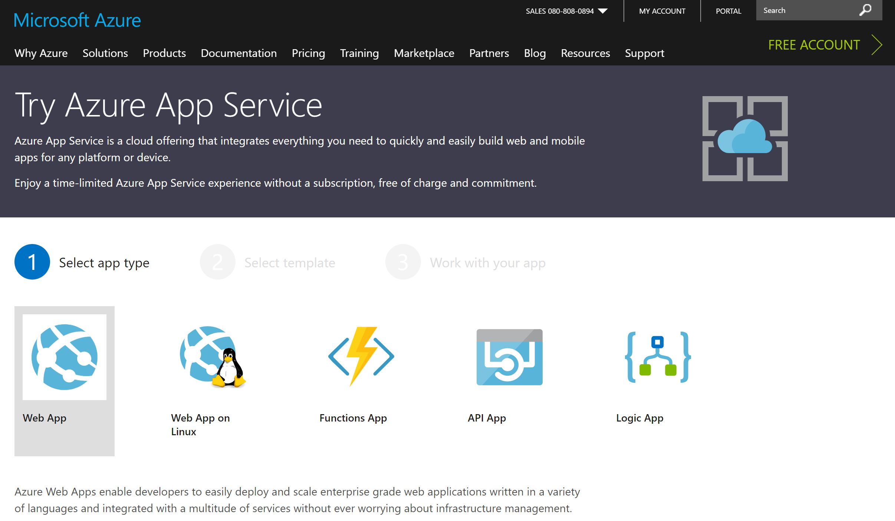

1.Select app type 에서 **Web App**을 선택한 후 **Next** 버튼을 눌러 다음단계로 넘어가시기 바랍니다.
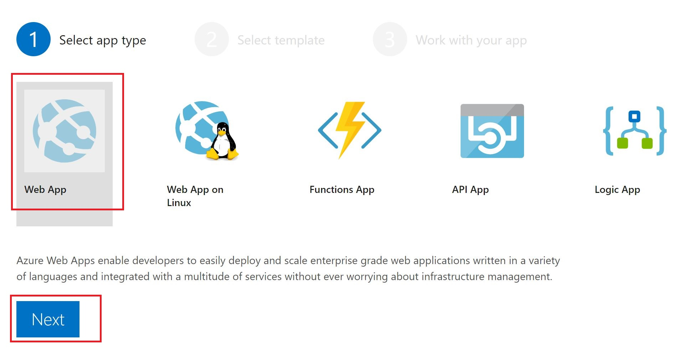

2.Select template 에서 **Empty**를 선택한 후 **Create** 버튼을 눌러 다음단계로 넘어가시기 바랍니다. 
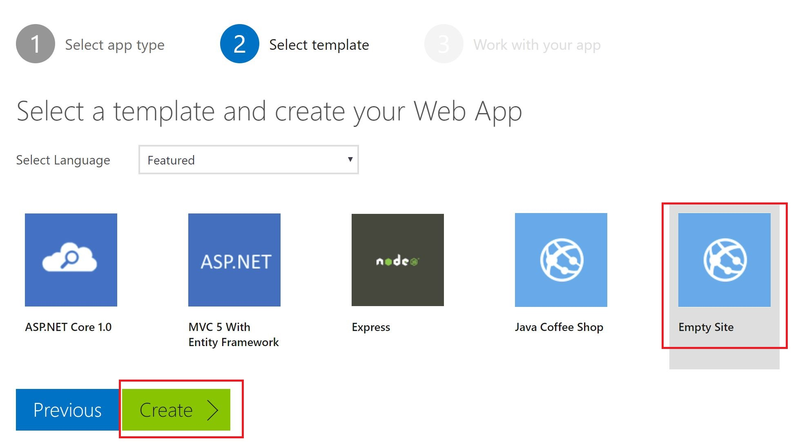

인증과 관련된 메세지가 나타납니다. 편하신 계정을 이용하여 로그인 하시고 사용하시기 바랍니다. (아까와 동일한 계정일 필요는 없습니다.)
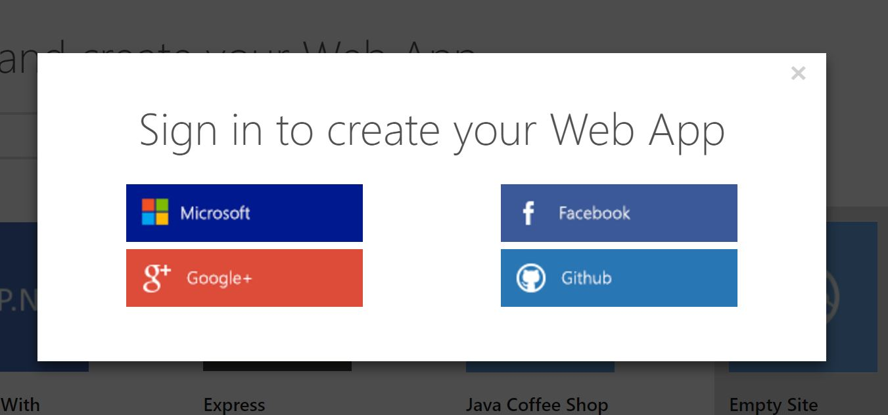

잠시 기다리면 아래와 같이 임시 Azure Web Apps 서비스가 생성됩니다. 이것은 여러분들의 서비스를 임시로 배포해볼 수 있는 환경이면서 동시에 Azure Web Apps의 편리한 여러가지 기능 중 몇 가지를 테스트 해보실 수 있습니다.  

## ftp로 파일 업로드하기 

Azure Web Apps에 우리가 만든 웹 페이지를 배포해보도록 하겠습니다. ftp를 이용하여 파일을 업로드 하려고 합니다. **Download publishing profile**을 클릭하셔서 파일을 다운로드 받으시기 바랍니다. 
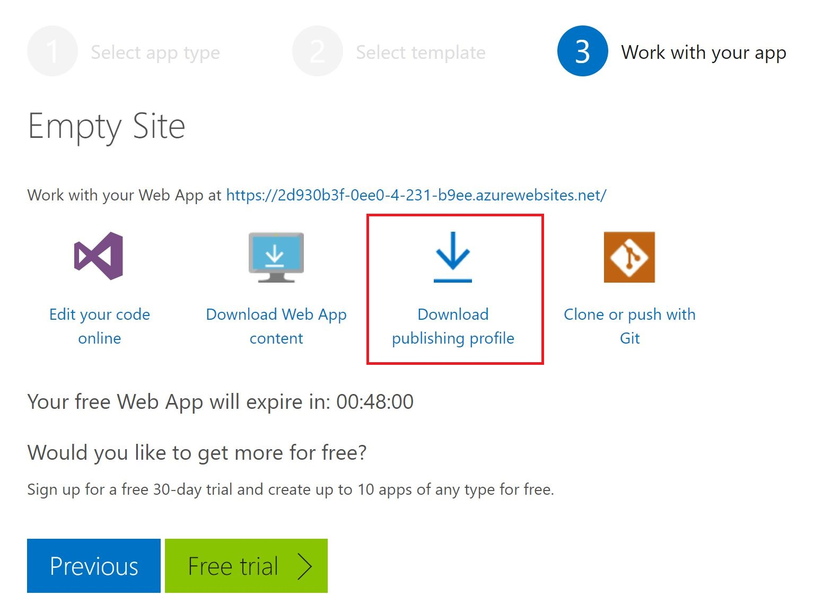

메모장이나 기타 편집기를 이용하여 publishing profile 파일을 오픈하시기 바랍니다. 파일을 열어보면 중간에 FTP 배포정보를 확인하실 수 있습니다. 
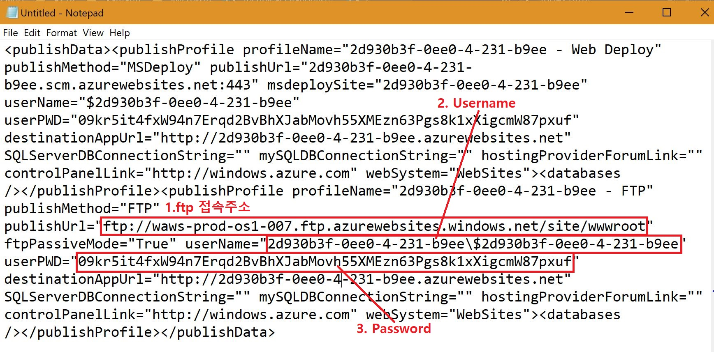

ftp로 파일을 업로드 하기 **FileZilla**라는 프로그램을 사용할 것입니다. [https://filezilla-project.org/](https://filezilla-project.org/)에 접속하고, **Download FileZilla Client** 버튼을 눌러서 설치 파일을 다운로드 받습니다. 
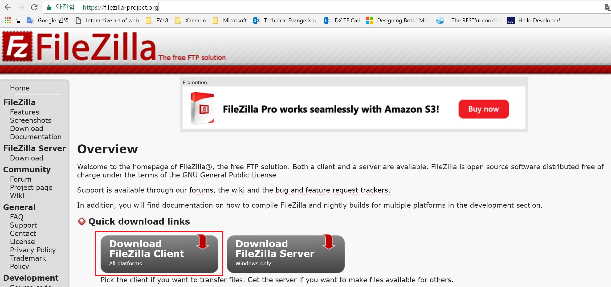

오른쪽의 **Download** 버튼을 눌러서 설치 파일을 다운로드 받으시기 바랍니다. 
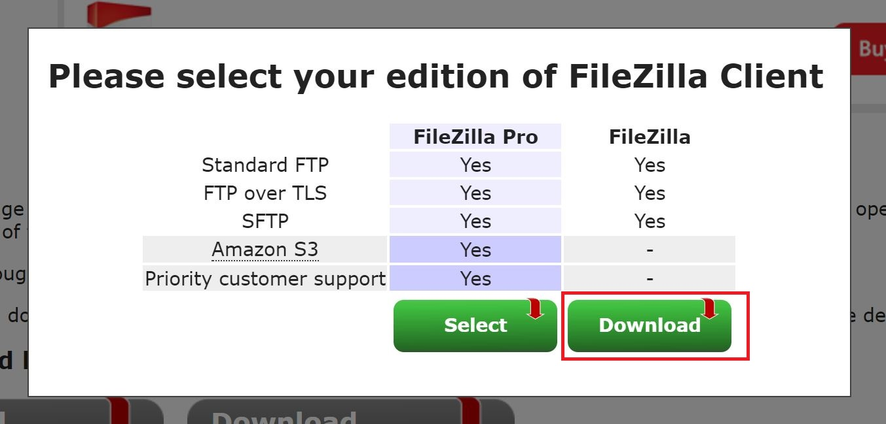

각자의 컴퓨터에 설치를 마저 진행하신 후 설치가 완료되면 FileZilla 프로그램을 오픈하시기 바랍니다. 
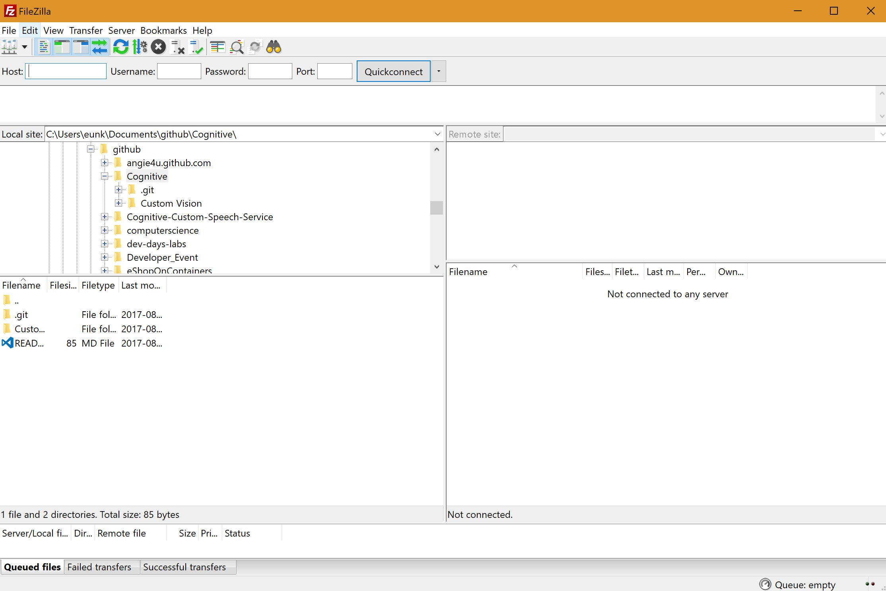

위에서 확인한 FTP 배포정보를 **Host, Username, Password** 정보에 각각 입력하시기 바랍니다. 

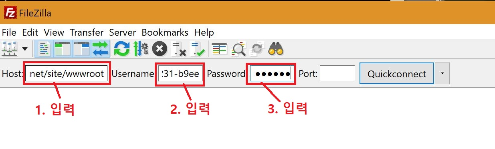

**Quickconnect** 버튼을 누르고 Certificate 확인 창에서 **OK**버튼을 누르면 접속 됩니다.
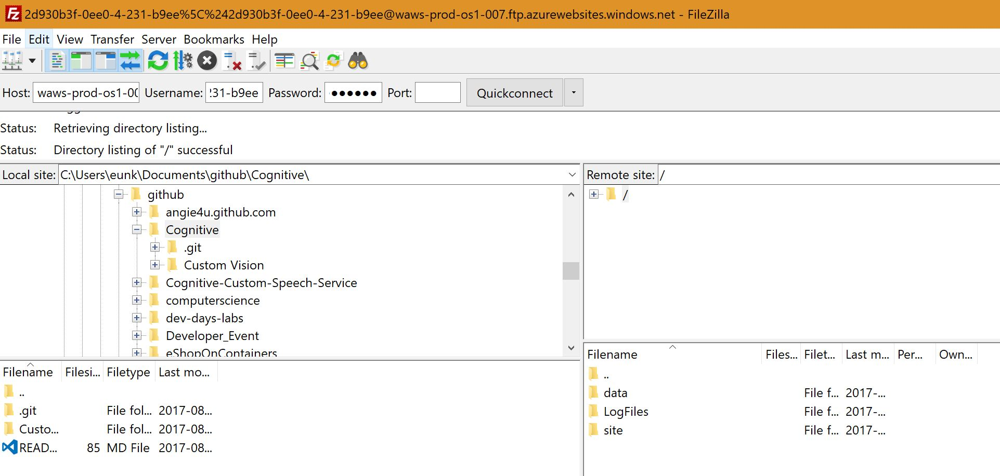

왼쪽의 영역에서는 **Custom Vision** 디렉토리로 이동하고, 오른쪽의 영역에서는 **site/wwwroot**로 이동하시기 바랍니다. 
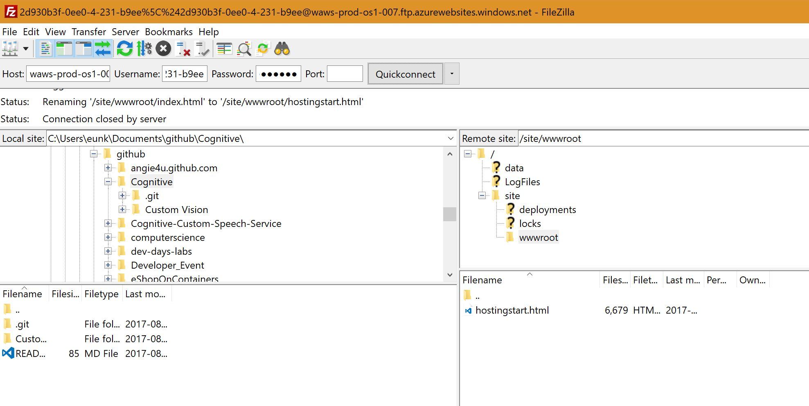

기존에 업로드 되어있는 **hostingstart.html** 파일을 삭제하시기 바랍니다. 
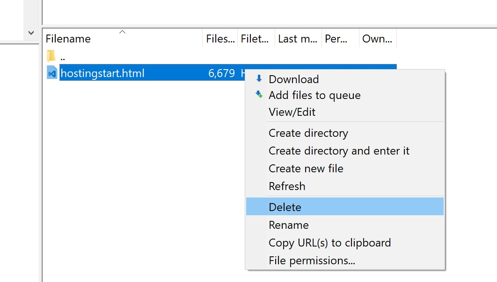

오른쪽의 영역에서 **Custom Vision/Example** 디렉토리로 이동하시기 바랍니다. 
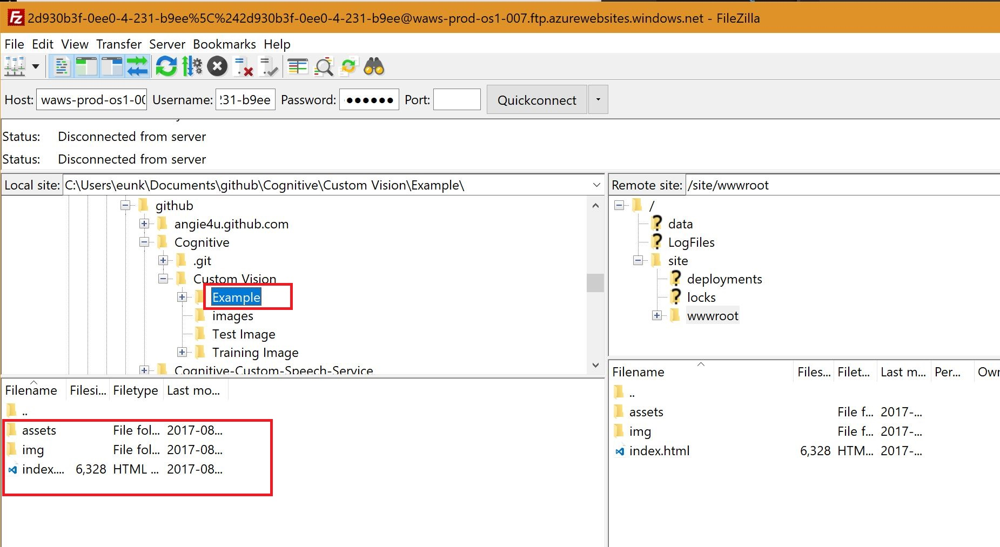

**assets, img 폴더 및 index.html** 파일을 서버로 업로드하시기 바랍니다. 
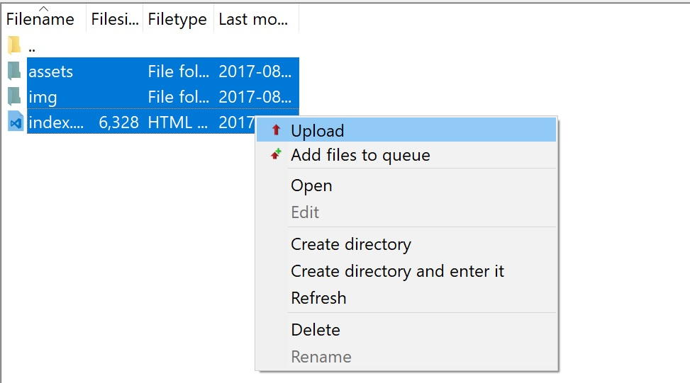

업로드가 완료되면 **wwwroot** 폴더 아래에 다음과 같이 업로드된 파일 목록을 확인하실 수 있습니다. 
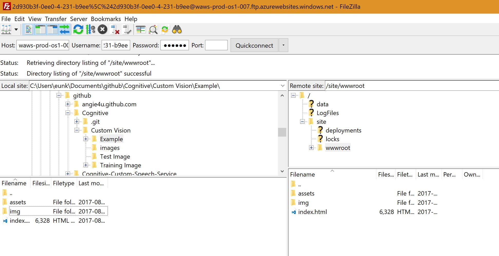

## 배포된 페이지에 접속하기

위에서 생성했던 Azure Web Apps 페이지로 이동해서 웹 페이지 주소를 확인합니다. 
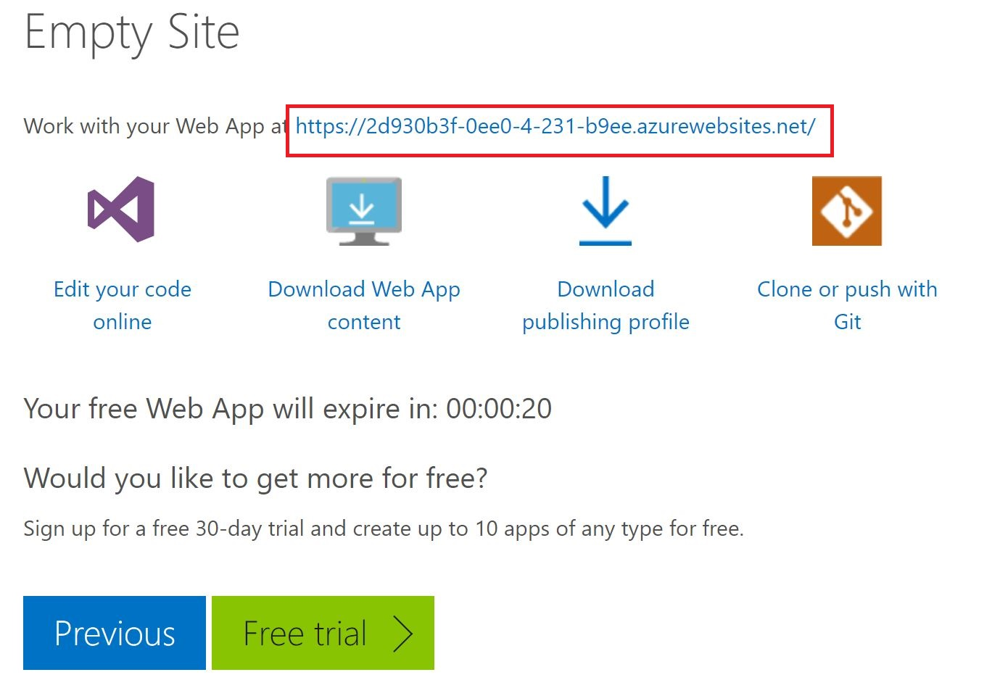

해당 주소에 접속해보시면 배포된 웹 페이지를 확인하실 수 있습니다. 
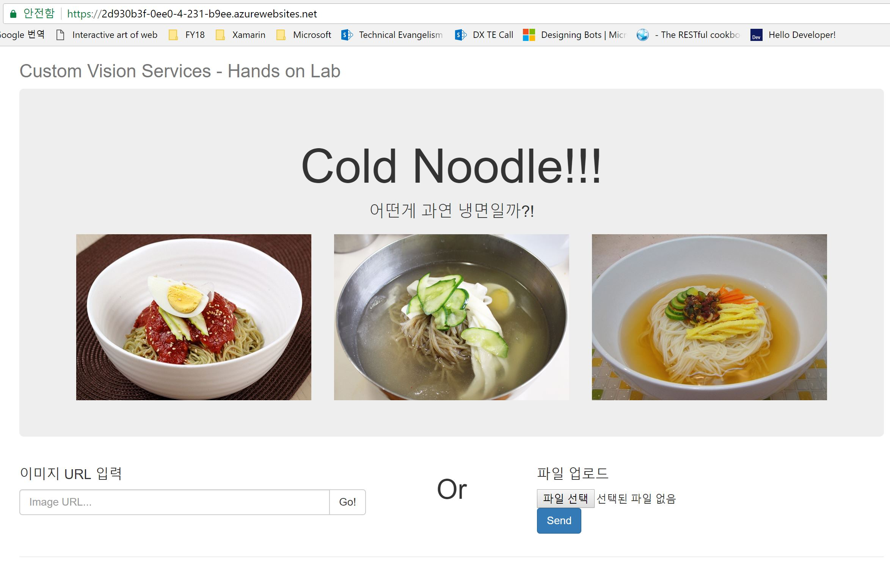

